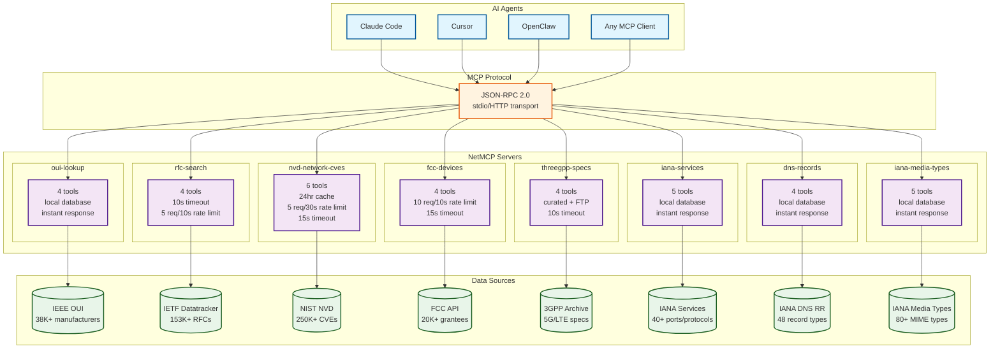

# NetMCP — Networking Intelligence for AI Agents

> Open-source MCP servers that give AI agents structured access to networking standards, device databases, and security data.

**Self-host for free** or use the **[hosted version on Apify →](https://apify.com/jugaad-lab)**

[](https://github.com/cheenu1092-oss/netmcp/actions/workflows/test.yml)
[](LICENSE)

## What is this?

AI agents helping network engineers constantly need to look up protocol specs, device info, and security vulnerabilities. Right now they hallucinate RFC numbers, guess at port assignments, and miss critical CVEs.

NetMCP fixes that by wrapping authoritative, free, public networking databases in [Model Context Protocol](https://modelcontextprotocol.io/) servers — so any AI agent (Claude, GPT, Cursor, OpenClaw, etc.) can query them directly.

## Packages

| Package | Data Source | Records | Status |
|---------|-----------|---------|--------|
| [`oui-lookup`](./packages/oui-lookup) | IEEE OUI (MAC → Vendor) | 38K+ manufacturers | ✅ Done |
| [`rfc-search`](./packages/rfc-search) | IETF Datatracker | 153K+ documents | ✅ Done |
| [`nvd-network-cves`](./packages/nvd-network-cves) | NIST NVD | 250K+ CVEs | ✅ Done |
| [`fcc-devices`](./packages/fcc-devices) | FCC Equipment Auth | 20K+ grantees | ✅ Done |
| [`threegpp-specs`](./packages/threegpp-specs) | 3GPP Archive | 5G/LTE standards | ✅ Done |
| [`iana-services`](./packages/iana-services) | IANA Service Registry | 40+ services/ports | ✅ Done |
| [`dns-records`](./packages/dns-records) | IANA DNS RR Types | 48 record types | ✅ Done |
| [`iana-media-types`](./packages/iana-media-types) | IANA Media Types | 80+ MIME types | ✅ Done |

## Architecture



**Key features:**
- ⚡ **Rate limiting** — All API-calling packages have thread-safe rate limiters (prevents API blocks)
- 🔒 **Input validation** — Max length checks, format validation, SQL injection protection
- ⏱️ **Timeouts** — All network calls have timeouts (10-15s) to prevent hangs
- 💾 **Caching** — NVD package has 24-hour in-memory cache (reduces API load, faster responses)
- ✅ **100% JSDoc coverage** — Full type annotations for IDE autocomplete and static analysis
- 🧪 **Comprehensive tests** — 36 smoke tests + 30 integration tests (66 total)
- 🚀 **Production-ready** — CI/CD, ESLint, npm workspaces, all security issues resolved

## Use it 3 ways

### 1. MCP Server (Claude Code, Cursor, OpenClaw, any MCP client)

```bash
# Clone and run locally
git clone https://github.com/cheenu1092-oss/netmcp.git
cd netmcp/packages/oui-lookup
npm install && npm start
```

Add to your MCP client config:
```json
{
  "mcpServers": {
    "oui-lookup": {
      "command": "node",
      "args": ["packages/oui-lookup/src/index.js"]
    },
    "rfc-search": {
      "command": "node",
      "args": ["packages/rfc-search/src/index.js"]
    },
    "nvd-network-cves": {
      "command": "node",
      "args": ["packages/nvd-network-cves/src/index.js"]
    },
    "fcc-devices": {
      "command": "node",
      "args": ["packages/fcc-devices/src/index.js"]
    },
    "threegpp-specs": {
      "command": "node",
      "args": ["packages/threegpp-specs/src/index.js"]
    },
    "iana-services": {
      "command": "node",
      "args": ["packages/iana-services/src/index.js"]
    },
    "dns-records": {
      "command": "node",
      "args": ["packages/dns-records/src/index.js"]
    },
    "iana-media-types": {
      "command": "node",
      "args": ["packages/iana-media-types/src/index.js"]
    }
  }
}
```

### 2. Apify Actor (hosted, pay-per-query)

No setup needed. Use via Apify Store:
- [OUI Lookup →](https://apify.com/jugaad-lab/oui-lookup)
- [RFC Search →](https://apify.com/jugaad-lab/rfc-search)
- [NVD Network CVEs →](https://apify.com/jugaad-lab/nvd-network-cves)
- [FCC Devices →](https://apify.com/jugaad-lab/fcc-devices)
- [3GPP Specs →](https://apify.com/jugaad-lab/threegpp-specs)
- IANA Services, DNS Records, and Media Types (coming soon to Apify Store)

### 3. OpenClaw / Claude Code Skill

```bash
# Install as an OpenClaw skill
clawhub install jugaad-lab/oui-lookup
```

## Usage Examples

Once configured in your MCP client, you can ask natural language questions and the AI will use the appropriate tool:

### OUI Lookup (MAC Address → Vendor)
**Ask:** "Who makes the device with MAC address 00:1A:2B:3C:4D:5E?"  
**Tool used:** `oui_lookup`  
**Response:**
```json
{
  "prefix": "001A2B",
  "found": true,
  "vendor": "Apple, Inc.",
  "address": "1 Infinite Loop, Cupertino CA 95014, US"
}
```

**Ask:** "Find all Cisco OUIs"  
**Tool used:** `oui_search`  
**Returns:** List of all MAC prefixes registered to Cisco

---

### RFC Search (Internet Standards)
**Ask:** "What's RFC 9293 about?"  
**Tool used:** `rfc_get`  
**Response:**
```json
{
  "name": "RFC9293",
  "title": "Transmission Control Protocol (TCP)",
  "abstract": "This document specifies the Internet Transmission Control Protocol (TCP)...",
  "status": "INTERNET STANDARD",
  "published": "2022-08",
  "url": "https://www.rfc-editor.org/rfc/rfc9293.html"
}
```

**Ask:** "Find recent RFCs about QUIC"  
**Tool used:** `rfc_search`  
**Returns:** List of QUIC-related RFCs with titles and links

---

### NVD Network CVEs (Security Vulnerabilities)
**Ask:** "Tell me about CVE-2023-44487 (HTTP/2 Rapid Reset)"  
**Tool used:** `cve_get`  
**Response:**
```json
{
  "cve_id": "CVE-2023-44487",
  "description": "HTTP/2 rapid reset vulnerability allows denial of service...",
  "cvss_score": 7.5,
  "severity": "HIGH",
  "published": "2023-10-10",
  "affected_products": ["nginx", "envoy", "apache-httpd", ...],
  "references": [...]
}
```

**Ask:** "Find recent WiFi vulnerabilities"  
**Tool used:** `cve_search`  
**Returns:** List of CVEs mentioning "wifi" in description

**Performance:** Includes 24-hour cache + rate limiting. Use `cve_cache_stats` to monitor.

---

### FCC Devices (Wireless Equipment Certifications)
**Ask:** "What wireless devices has Apple gotten FCC approval for recently?"  
**Tool used:** `fcc_search` (by name: "Apple")  
**Response:**
```json
{
  "query": "Apple",
  "count": 143,
  "results": [
    {
      "grantee_name": "Apple Inc.",
      "grantee_code": "BCG",
      "country": "United States",
      "date_received": "2024-01-15"
    },
    ...
  ]
}
```

**Ask:** "Show me recent FCC certifications from China"  
**Tool used:** `fcc_search` (by country: "China")  
**Returns:** List of recent wireless device approvals

---

### 3GPP Specs (5G/LTE Standards)
**Ask:** "What's 3GPP spec 23.501 about?"  
**Tool used:** `spec_get`  
**Response:**
```json
{
  "number": "23.501",
  "title": "System architecture for the 5G System (5GS)",
  "series": "23_series",
  "technology": "Core Network and Terminals",
  "release": 16,
  "status": "Under change control",
  "url": "https://www.3gpp.org/ftp/Specs/archive/23_series/23.501/"
}
```

**Ask:** "Find 3GPP specs about network slicing"  
**Tool used:** `spec_search`  
**Returns:** List of specs with "slicing" in title (28.801, 23.501, etc.)

---

### IANA Services (Port & Protocol Lookup)
**Ask:** "What service runs on port 443?"  
**Tool used:** `service_by_port`  
**Response:**
```json
{
  "port": 443,
  "services": [
    {
      "name": "https",
      "protocol": "tcp",
      "description": "HTTP over TLS/SSL",
      "assignee": "IETF",
      "rfc": "RFC 2818"
    }
  ]
}
```

**Ask:** "Search for VPN services"  
**Tool used:** `service_search`  
**Returns:** List of VPN/tunneling services (IPsec, OpenVPN, L2TP)

---

### DNS Records (Resource Record Types)
**Ask:** "What's a DNS AAAA record?"  
**Tool used:** `record_by_name`  
**Response:**
```json
{
  "type": 28,
  "name": "AAAA",
  "description": "IPv6 address record",
  "rfc": "RFC 3596",
  "category": "Data"
}
```

**Ask:** "Find DNS security record types"  
**Tool used:** `record_search` (keyword: "dnssec")  
**Returns:** DNSKEY, RRSIG, NSEC, DS, NSEC3, TLSA, and more

---

### IANA Media Types (MIME Type Lookup)
**Ask:** "What's the MIME type for .webp files?"  
**Tool used:** `media_by_extension`  
**Response:**
```json
{
  "extension": ".webp",
  "media_type": "image/webp",
  "description": "WebP image format",
  "rfc": "WebP Specification",
  "category": "image"
}
```

**Ask:** "Show me all video formats"  
**Tool used:** `media_by_category` (category: "video")  
**Returns:** video/mp4, video/webm, video/ogg, video/quicktime, etc.

---

## Why these data sources?

All data is **free, public, and authoritative**:
- **IEEE OUI** — Official MAC address vendor registry (38K+ manufacturers)
- **IETF/RFC** — Every internet standard ever written (153K+ documents)
- **NIST NVD** — US government vulnerability database (250K+ CVEs)
- **FCC EAS** — Official US wireless equipment certifications (20K+ grantees)
- **3GPP** — Global 5G/LTE/NR standards body (5K+ specifications)
- **IANA Services** — Official port and protocol number registry (40+ common services)
- **IANA DNS RR Types** — Official DNS resource record type registry (48 record types)
- **IANA Media Types** — Official MIME type registry (80+ common types)

**No API keys needed. No rate limit issues. No scraping gray areas.**

## Technical Features

- ✅ **100% JSDoc type coverage** — IDE autocomplete, static analysis
- ✅ **Thread-safe rate limiting** — prevents API throttling under concurrent load
- ✅ **24-hour caching (NVD)** — faster responses, reduced API pressure
- ✅ **Comprehensive test suite** — 66 tests (36 smoke + 30 integration)
- ✅ **CI/CD with GitHub Actions** — tests on Node.js 20.x, 22.x, 24.x
- ✅ **ESLint + type validation** — zero errors, zero warnings
- ✅ **npm workspaces** — efficient monorepo with hoisted dependencies
- ✅ **Production-ready** — timeouts, error handling, input sanitization

## Built by

**[Nagarjun Srinivasan](https://github.com/nagaconda)** — Principal Systems Engineer at HPE Networking, holder of [US Patent 10986606](https://patents.google.com/patent/US10986606) on wireless signal strength methods. Building AI-driven self-driving networks by day, open-source networking tools by night.

Part of the **[jugaad-lab](https://github.com/jugaad-lab)** open source collective.

## Contributing

PRs welcome! See [CONTRIBUTING.md](CONTRIBUTING.md) for guidelines.

## License

MIT — use it however you want.
